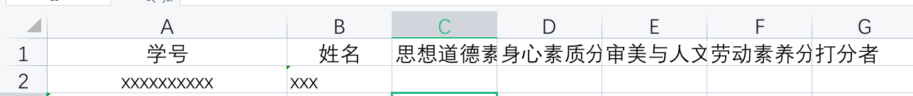

# 提flaskExcelRate

--一个用来应付学校综测互评的纯后端网站
*适用范围仅限UESTC，问就是比较数据那些是按copilot出来的，非常的外包和丑陋*
~~但你能指望我能在3小时内写什么呢~~

## 功能

1. 自动导入表格，判断需要填写的项目
2. 纠错，防止填入的数据过于离谱
3. 自动分析结果：访问/rank
4. 能够下载表格:/download（需要提前添加表格进去）

## 安装与部署

1. 安装flask,flask_excel,pyexcel,pyexcel_xlsx
2. cd进对应目录，部署好你的样板表格并在代码中修改
3. python -m flask run
4. 使用cpolar等内网透穿工具进行远程访问的开启。

## 表格的示例

需要放在static文件夹中，并且修改app.py中 `nameList=pyexcel.get_records(file_name=os.path.join(APP_STATIC_STATIC, '10班名单.xlsx'))此句中的表格名称为你放入的表格名称，之后会对该表格中的人数等进行核对。（需要保证表头全部一致）`

打分者那一列都写学号，具体样式的lint在：util/Checker.py: `iflen(str(dict1[i]['打分者'])) !=13orstr(dict1[i]['打分者'])[:10] !='2021010910':`
